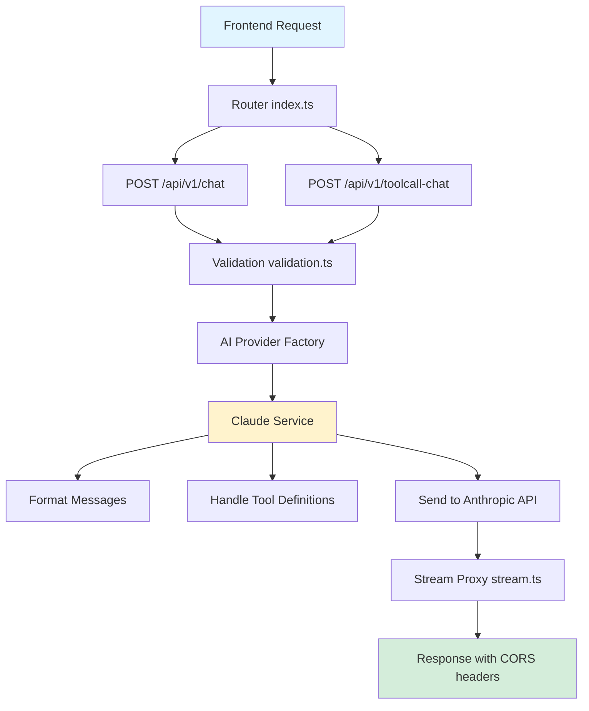
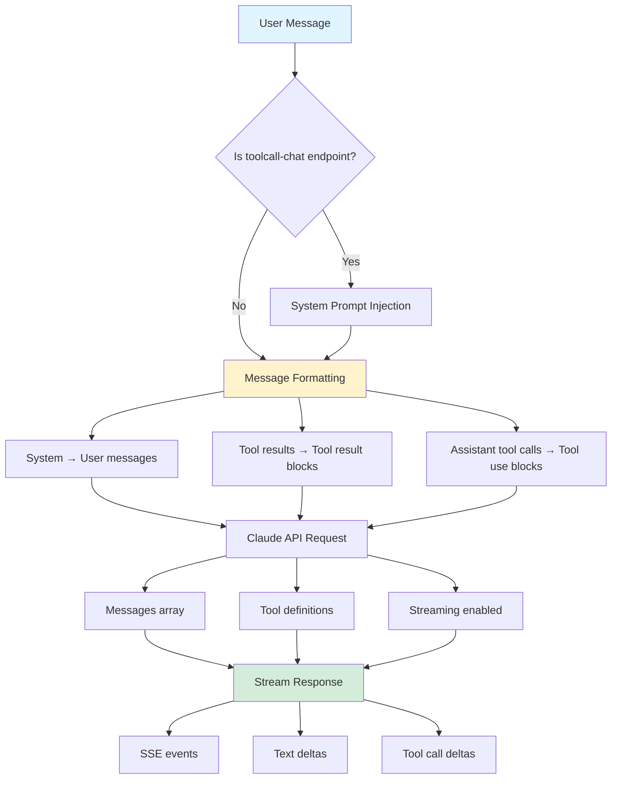

# Backend - Cloudflare Worker

Serverless backend that proxies requests to Claude AI API with tool calling support. Handles chat requests, manages streaming responses, and provides a flexible architecture for switching between AI providers.

## Architecture

The backend is built as a Cloudflare Worker that acts as a proxy between the frontend and Claude AI API. It handles request validation, message formatting, streaming, and error handling.

### Request Flow



### Message Processing Flow



## Key Components

<details>
<summary>Click to expand component details</summary>

### Entry Point (`src/index.ts`)

Handles incoming requests, routes to appropriate handlers, and manages CORS.

### Handlers (`src/handlers/chat.handler.ts`)

- `handleChatRequest`: Standard chat endpoint
- `handleToolcallChatRequest`: Chat endpoint with automatic system prompt injection

Both handlers validate requests, format messages, call the AI provider, and proxy streaming responses.

### Services

#### Claude Service (`src/services/claude.service.ts`)

Implements the `AIProvider` interface for Claude API integration:

- Formats messages to Claude's message format
- Converts tool results to Claude's tool result blocks
- Handles assistant tool calls as tool use blocks
- Manages streaming responses

#### AI Provider Factory (`src/services/ai-provider.factory.ts`)

Factory pattern for creating AI provider instances. Currently supports:
- Claude (implemented)
- OpenAI (placeholder)
- Gemini (placeholder)

To switch providers, set the `AI_PROVIDER` environment variable to `claude`, `openai`, or `gemini`.

### Utilities

- `stream.ts`: Proxies streaming responses from AI provider to frontend
- `validation.ts`: Validates incoming request structure
- `cors.ts`: Handles CORS headers for cross-origin requests
- `errors.ts`: Custom error classes for different error types
- `router.ts`: Simple routing implementation for Cloudflare Workers

</details>

## Configuration

### Environment Variables

Set in `.dev.vars` for local development or via Cloudflare secrets for production:

- `ANTHROPIC_API_KEY`: Your Claude API key from Anthropic
- `AI_PROVIDER`: AI provider to use (`claude`, `openai`, or `gemini`)
- `CORS_ORIGIN`: Optional CORS origin (defaults to allowing all origins)

### Claude Configuration (`src/config/constants.ts`)

- API URL: `https://api.anthropic.com/v1/messages`
- Model: `claude-sonnet-4-5`
- API Version: `2023-06-01`
- Streaming: Enabled by default

## Switching AI Providers

The backend uses a factory pattern to support multiple AI providers. To switch providers:

1. Set the `AI_PROVIDER` environment variable:
   ```bash
   # In .dev.vars for local development
   AI_PROVIDER=claude
   
   # Or via Cloudflare Workers dashboard for production
   ```

2. Ensure the corresponding API key is set:
   - Claude: `ANTHROPIC_API_KEY`
   - OpenAI: `OPENAI_API_KEY` (when implemented)
   - Gemini: `GEMINI_API_KEY` (when implemented)

3. Implement the provider service (if not already implemented):
   - Create a new service class implementing `AIProvider` interface
   - Add the provider case to `AIProviderFactory.create()`

The factory automatically selects the provider based on the `AI_PROVIDER` environment variable, making it easy to switch between providers without code changes.

## Message Format

The backend uses a standard message format compatible with most LLMs:

```typescript
interface Message {
  role: 'system' | 'user' | 'assistant' | 'tool';
  content: string | MessageContent[];
  tool_calls?: ToolCall[];
  tool_call_id?: string;
}
```

Messages are automatically converted to Claude's format:
- System messages become user messages with system content
- Tool results become tool result blocks
- Assistant tool calls become tool use blocks

## Streaming

The backend supports Server-Sent Events (SSE) streaming. When streaming is enabled:

1. The AI provider response is proxied directly to the frontend
2. No buffering or processing occurs on the backend
3. CORS headers are added to allow cross-origin streaming
4. The stream is properly closed on completion or error

## Error Handling

The backend implements structured error handling:

- `ValidationError`: Invalid request format (400)
- `ConfigurationError`: Missing or invalid configuration (400)
- `ProviderError`: AI provider API errors (500+)

All errors are returned with appropriate HTTP status codes and error messages.

## Development

### Local Development

```bash
npm run dev
```

Starts the worker on `http://localhost:8787` with hot reload.

### Type Checking

```bash
npm run type-check
```

### Deployment

```bash
npm run deploy
```

Make sure to set secrets in Cloudflare before deploying:
```bash
wrangler secret put ANTHROPIC_API_KEY
```

