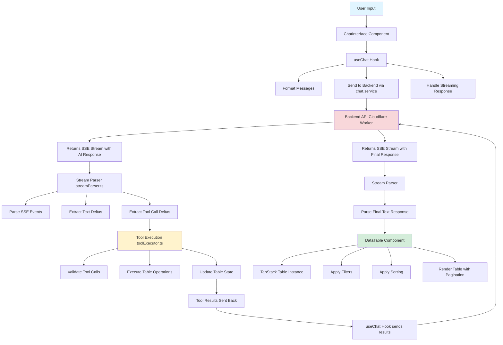
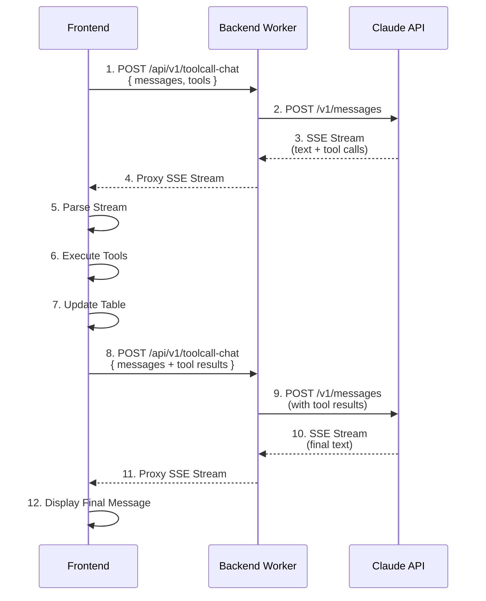

# Frontend - React Application

React application that provides a chat interface and data table management through TanStack Table. Users interact with the table using natural language commands processed by the AI backend.

## Architecture

The frontend is built with React 19, TypeScript, and Vite. It uses TanStack Table for table functionality and implements a custom chat interface with streaming support.

### Application Flow



### Communication Flow



## Tool Calling Flow

1. User sends message via chat input
2. Message is sent to backend with tool definitions
3. Backend forwards to Claude with tools
4. Claude responds with tool calls (streaming)
5. Frontend parses tool calls from stream
6. Tools are executed locally (table operations)
7. Tool results are sent back to backend
8. Backend forwards tool results to Claude
9. Claude provides final text response
10. Response is displayed to user

This cycle continues for each user message, allowing the AI to use tools as needed to fulfill user requests.

## Key Components

<details>
<summary>Click to expand component details</summary>

### Pages

#### DashboardPage (`src/pages/DashboardPage.tsx`)

Main application page that combines the data table and chat interface. Manages:
- Table data state
- Sorting state
- Filter state
- Tool execution coordination
- Error handling

### Components

#### DataTable (`src/components/DataTable.tsx`)

TanStack Table implementation with:
- Column definitions for all table fields
- Custom filter function supporting multiple operators
- Sorting with visual indicators
- Pagination controls
- Loading overlay during tool execution

#### ChatInterface (`src/components/ChatInterface.tsx`)

Chat UI component that:
- Displays message history
- Handles user input
- Shows streaming responses
- Displays tool call execution status
- Manages error states

#### ChatMessages (`src/components/ChatMessages.tsx`)

Renders the message list with:
- User messages
- Assistant messages (streaming support)
- Tool call indicators
- Thinking states

#### ChatInput (`src/components/ChatInput.tsx`)

Input component with:
- Send button
- Cancel button (during streaming)
- Keyboard shortcuts (Enter to send)
- Character limits

</details>

## TanStack Table Integration

<details>
<summary>Click to expand TanStack Table details</summary>

TanStack Table is used for all table functionality. The implementation includes:

### Column Configuration

```typescript
{
  accessorKey: 'name',
  header: 'Name',
  enableSorting: true,
  filterFn: customFilterFn,
}
```

All columns support:
- Sorting (ascending/descending)
- Custom filtering with multiple operators
- Type-specific formatting (e.g., currency for amount)

### Filter Function

The custom filter function (`customFilterFn`) supports:

- **Numeric operators**: `>`, `<`, `>=`, `<=`, `==`, `!=`
- **Text operators**: `==`, `!=`, `contains`, `startsWith`, `endsWith`
- **Date operators**: `>`, `<`, `>=`, `<=`, `==`, `!=` (with date parsing)
- **Case-insensitive** text comparisons

Filters are additive - multiple filters can be applied simultaneously to different columns.

### State Management

Table state is managed at the page level:
- `sorting`: Array of sort configurations
- `columnFilters`: Array of filter configurations
- `data`: Table row data

State is updated through tool execution, not directly by user interaction with the table UI.

</details>

## Hooks

<details>
<summary>Click to expand Hooks details</summary>

### useChat (`src/hooks/useChat.ts`)

Manages chat state and communication with the backend:

- Message history management
- Streaming response handling
- Tool call detection and execution coordination
- Tool result submission back to AI
- Error handling
- Request cancellation

The hook handles the complete tool calling cycle:
1. User sends message
2. AI responds with tool calls
3. Tools are executed
4. Tool results are sent back to AI
5. AI provides final response

</details>

## Services

<details>
<summary>Click to expand Services details</summary>

### Chat Service (`src/services/chat.service.ts`)

Handles HTTP communication with the backend:

- Sends chat requests with messages and tool definitions
- Processes SSE stream responses
- Parses text deltas and tool call deltas
- Manages request cancellation
- Handles errors

</details>

## Utilities

<details>
<summary>Click to expand Utilities details</summary>

### Tool Executor (`src/utils/toolExecutor.ts`)

Executes tool calls and updates table state:

- `executeToolCall`: Executes a single tool call
- `customFilterFn`: Custom filter function for TanStack Table

Supported tools:
- `filterTable`: Apply column filters
- `sortTable`: Sort by column
- `addRow`: Add new rows
- `deleteRow`: Remove rows
- `clearFilters`: Clear all filters
- `clearSorting`: Clear sorting

### Tool Definitions (`src/utils/toolDefinitions.ts`)

Defines tool schemas sent to the AI. Each tool includes:
- Name
- Description
- Input schema (JSON Schema format)
- Required parameters

### Stream Parser (`src/utils/streamParser.ts`)

Parses SSE stream from backend:

- Handles Claude's streaming format
- Extracts text deltas
- Extracts tool call deltas (progressive JSON parsing)
- Accumulates complete tool calls
- Handles stream completion

</details>

## State Management

<details>
<summary>Click to expand State Management details</summary>

The application uses React state management:

- **Component state**: Local UI state (input values, loading states)
- **Page state**: Shared state between table and chat (data, filters, sorting)
- **Hook state**: Chat-specific state (messages, streaming)

State updates flow:
1. User action → Hook/Component
2. API call → Backend
3. Response → State update
4. Re-render → UI update

</details>

## Error Handling

<details>
<summary>Click to expand Error Handling details</summary>

Error handling is implemented at multiple levels:

- **Network errors**: Handled by chat service with user-friendly messages
- **Tool execution errors**: Displayed in tool error messages
- **Validation errors**: Prevented through input validation
- **Stream errors**: Handled gracefully with fallback messages

</details>

## Configuration

### Environment Variables

Set in `.env` file:

- `VITE_API_BASE_URL`: Backend API URL (default: `http://localhost:8787`)

### Constants (`src/config/constants.ts`)

- `API_BASE_URL`: Backend API base URL
- `CHAT_ENDPOINT`: Chat API endpoint (`/api/v1/toolcall-chat`)
- `DEFAULT_PAGE_SIZE`: Default pagination size (11)
- `INPUT_MAX_LENGTH`: Maximum input length (5000)
- `ERROR_DISMISS_DURATION`: Error message display duration (5000ms)

## Development

### Local Development

```bash
npm run dev
```

Starts the development server with hot reload.

### Build

```bash
npm run build
```

Creates production build in `dist/` directory.

### Preview

```bash
npm run preview
```

Preview the production build locally.

### Linting

```bash
npm run lint
```

## Data Structure

### TableRow

```typescript
interface TableRow {
  id: string;
  name: string;
  amount: number;
  status: 'active' | 'inactive' | 'pending';
  date: string; // YYYY-MM-DD format
  category: string;
}
```

### Message Format

```typescript
interface ChatMessage {
  id: string;
  role: 'user' | 'assistant' | 'tool';
  content: string;
  toolCalls?: ToolCall[];
  toolCallId?: string;
}
